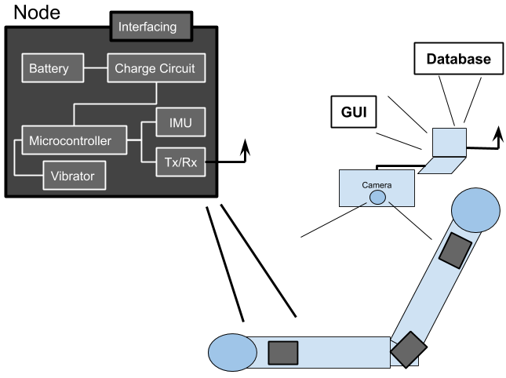
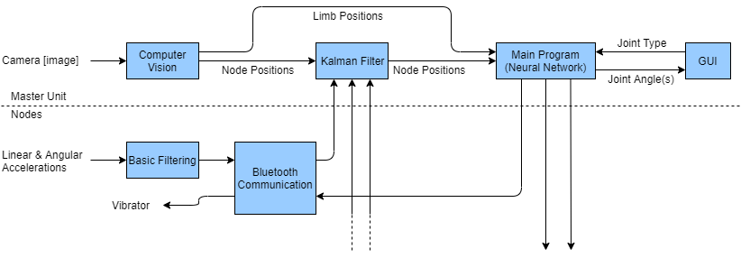
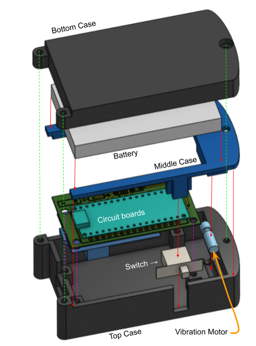

***Joint Range of Motion Device Using IMU Nodes***
----------------------------------------------------

#### Overview
This is our group's fourth year design project for the University of Waterloo.

The goal of this project is to properly apply filtering and deadreckoning techniques to a set of customly designed arduino based IMU nodes. These nodes will communicate their data to a central hub via bluetooth, where the ultimate goal is to be able to use this data in a useful way. The current idea is to use this system within the area of physiotherapy, where the data from the nodes will be able to quantify the flexibility, range of motion, and improvement over time for a practisioner's patients in a simple and non-obstructive fashion.

The high level architecture for these nodes is given below, where each nodes will contain its own power source with an adequate charging circuit.

Overall the current goals for the flow of the IMU data, in addition to our goals for filtering are shown below. Where we hope to use a kalman filter that uses both IMU and camera data in order to minimize drift.

At this stage the current overall mechanical design for the nodes looks like the below. Improvements may be able to be made in the future, but currently the size is limited by both battery size, and the nessessity to merge multiple off the shelf boards together to accelerate prototyping.

#### Getting Started
We're using PlatformIO to manage our arduino driven communicaiton. Here's the getting started guide: https://docs.platformio.org/en/latest/ide/vscode.html#installation

Make sure you install for VSCode instead of Atom on *Windows*. The PlatformIO ide provides the build, flash, and serial monitor in the bottom toolbar. The board settings are in the `platformio.ini` file.

#### Bill of Materials
i would like to fill this in a bit later

